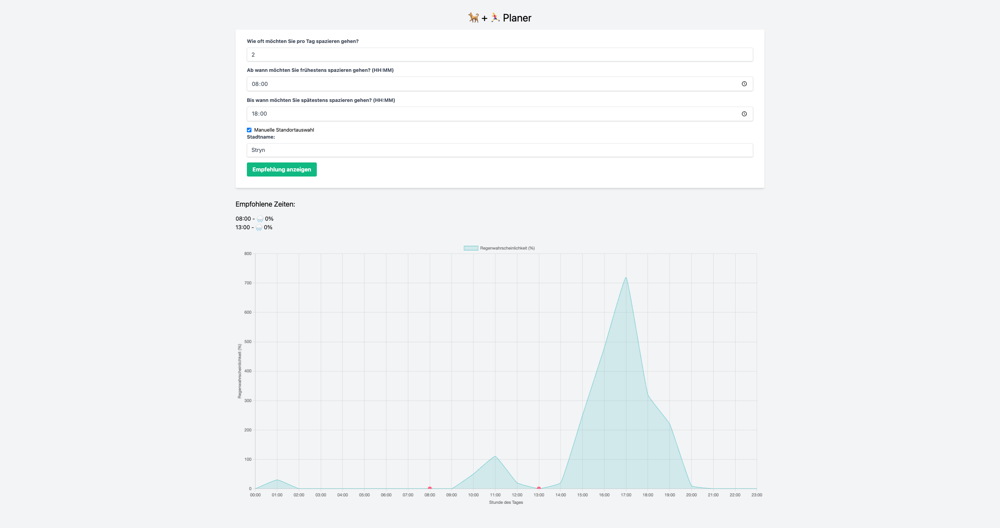

# 🐕 + 🏃‍♂️ Gassi gehen Planer

This project is a weather-based dog walking planner, developed during a [Mini-Hackathon](https://minihackathon.de/) by [Kevin Chromik](https://github.com/kchromik). It helps dog owners plan their walks by providing recommendations based on weather conditions and user preferences.

## Features

- **Walk Time Recommendations:** Provides optimal walk times with the lowest precipitation probability.
- **Interactive Rain Probability Chart:** Visual representation of rain probability throughout the day.
- **Automatic or Manual Location Selection:** Choose to use your current location or manually input a city.

## Demo



## Installation

1. Clone the repository:
   ```sh
   git clone https://github.com/kevincromik/gassi-gehen-planer.git
   cd gassi-gehen-planer
   ```
2. Open `index.html` in your preferred web browser.

## Usage

1. Open the application.
2. Fill in your preferences:
   - How many times you want to walk your dog per day.
   - The earliest and latest times for walks.
3. Choose your location:
   - Check the "Manual Location Selection" box to input a city name.
   - Leave it unchecked to use your current location.
4. Click "Show Recommendations" to get the best times for walks.

## Technologies Used

- HTML, CSS (Tailwind CSS)
- JavaScript
- Open-Meteo API
- Chart.js
